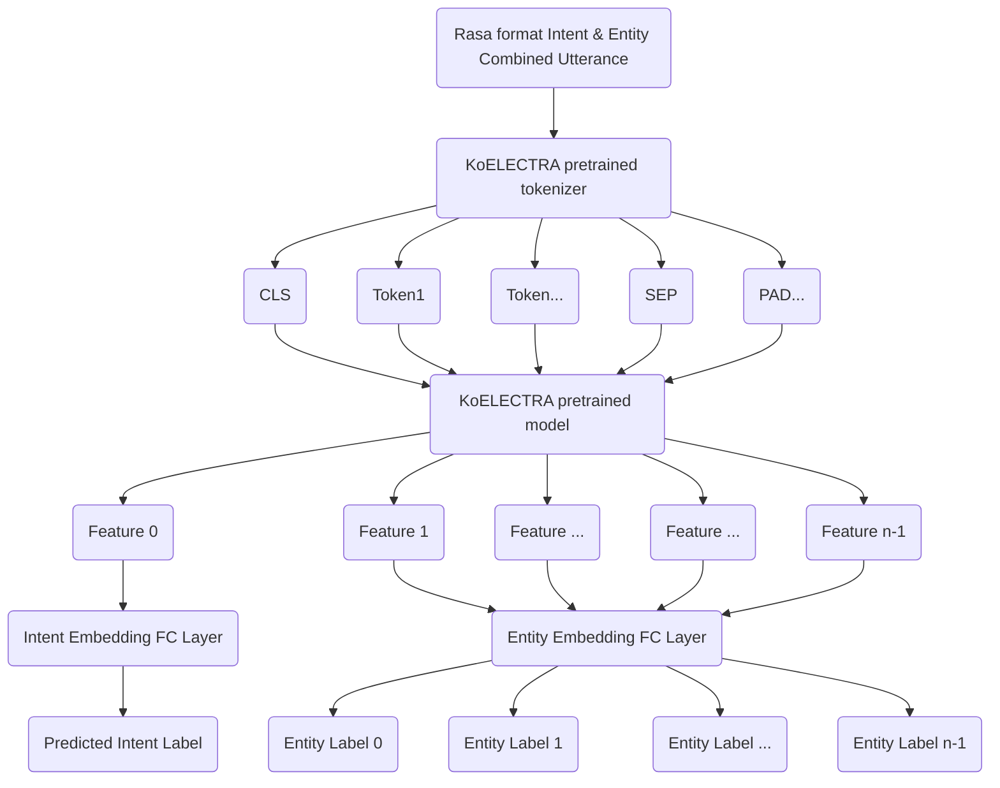

# eletrasa
ELECTRA pre-trained model + RASA dataset based custom model

## Model Architecture

```mermaid
graph TD
A(Rasa format Intent & Entity Combined Utterance) --> B(KoELECTRA pretrained tokenizer)
B --> C(CLS)
B --> D(Token1)
B --> E(Token...)
B --> F(SEP)
B --> G(PAD...)
C --> H(KoELECTRA pretrained model)
D --> H
E --> H
F --> H
G --> H
H --> I(Feature 0)
H --> J(Feature 1)
H --> K(Feature ...)
H --> L(Feature ...)
H --> M(Feature n-1)
I --> N(Intent Embedding FC Layer)
J --> O(Entity Embedding FC Layer)
K --> O
L --> O
M --> O
N --> P(Predicted Intent Label)
O --> Q(Entity Label 0)
O --> R(Entity Label 1)
O --> S(Entity Label ...)
O --> T(Entity Label n-1)
```

Still work in progress

## Reference
[KoELECTRA](https://github.com/monologg/KoELECTRA)
