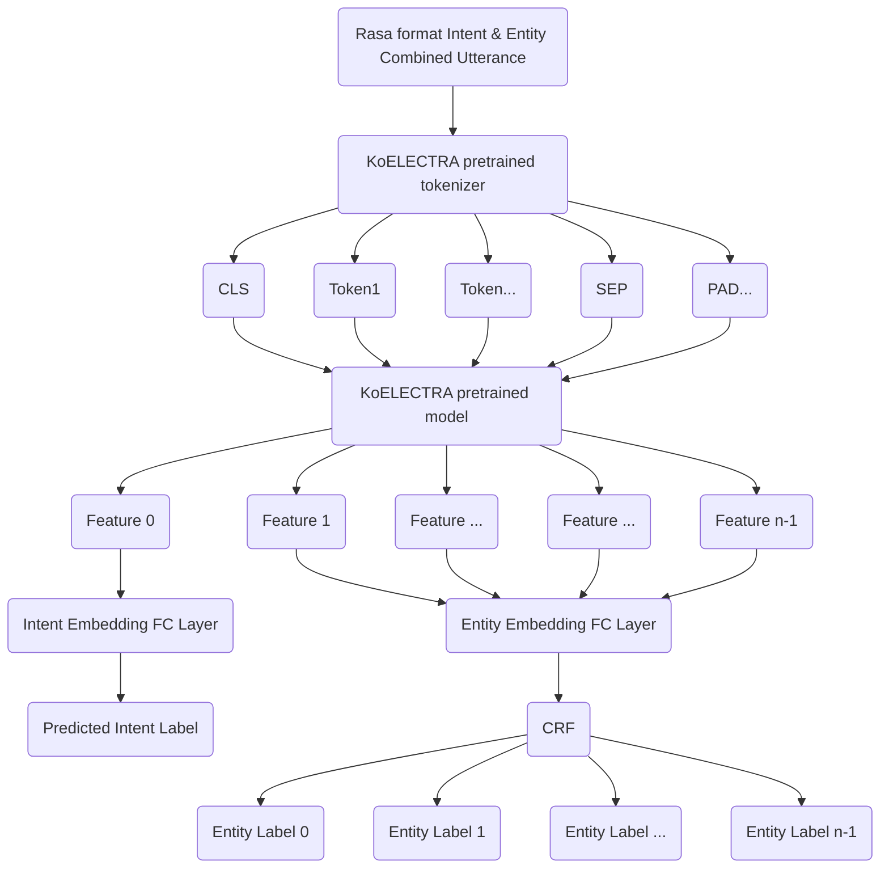

# eletrasa
ELECTRA pre-trained model + RASA dataset based custom model

## Model Architecture

## Training & Deployment Process

## Reference
[KoELECTRA](https://github.com/monologg/KoELECTRA)

[pytorch-center-loss](https://github.com/KaiyangZhou/pytorch-center-loss)
